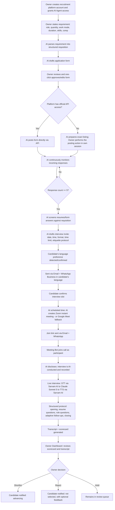

# Workflow Document
## AI Recruiter Agent — Conversational Agentic Hiring Assistant

**Version:** 2.0 (Revised per updated workflow)
**Date:** July 15, 2026

---

## 1. End-to-End Process Flow

## 2. Stage-by-Stage Breakdown

### Stage 0: Account & Access Setup
- Owner creates the recruitment platform account (the product itself) and connects available job-platform accounts (LinkedIn, Naukri, Internshala, company career page, etc.) plus Email and WhatsApp Business.
- Owner grants the AI Agent operating permission within the product — this is distinct from, and does not itself grant, official API access to third-party platforms; those remain gated per platform policy (see TRD).

### Stage 1: Requirement Intake (Conversational)
- Owner tells the AI, in plain language, what's needed: role, headcount, work mode (onsite/remote/hybrid), duration, compensation/stipend, must-have skills, eligibility.
- AI extracts structured fields and asks **one clarifying question at most** if something critical is missing or ambiguous (e.g., "Should this be open to final-year students or only graduates?").
- Structured requisition is saved as the single source of truth for the form, screening rubric, and interview question bank.

### Stage 2: Form Generation & Approval
- AI drafts a candidate-facing application form matching the requisition (resume upload, key questions, availability, language preference).
- Owner reviews in a preview screen and approves or edits — **this step is never skipped or silently auto-published**.

### Stage 3: Distribution
- Where the Owner has official platform API access, AI posts directly.
- Where it doesn't (verified: LinkedIn/Naukri/Internshala are gated or lack public APIs as of July 2026), AI prepares the exact listing text/format and the Owner performs the actual posting click within their own logged-in session — keeping a human in the loop for any action on a third-party platform's interface.

### Stage 4: Response Monitoring
- AI polls/receives applications continuously, deduplicating across sources.
- A live counter tracks responses per requisition.
- Once the response threshold is met (**default 5**, Owner-configurable), the pipeline automatically advances to outreach — no manual trigger needed.

### Stage 5: Interview Invitation (Multi-Channel, Multilingual)
- AI drafts the invitation content: interview date, time, format (video call), time limit, and a short etiquette/protocol note (camera on, quiet space, ID check, punctuality expectations).
- Sent via **both Email and WhatsApp Business** (approved message templates), in the candidate's selected language (English, Hindi, or Marathi).
- Candidate confirms their slot (or requests reschedule within an Owner-defined window).

### Stage 6: Automated Meeting Creation
- At the scheduled time, AI creates an **instant Zoom meeting** (primary path — most mature instant-meeting API/SDK support) or a **Google Meet link** (fallback, e.g., candidate preference or Zoom unavailable).
- Join link is sent via Email and WhatsApp shortly before start time.

### Stage 7: Live AI-Conducted Interview
- A **Meeting Bot** (Recall.ai / MeetStream.ai style service) joins the call as a participant — no host permission required, works the same way across Zoom and Meet.
- At join, the AI **clearly discloses** that it is an AI interviewer and that the session is recorded (reinforcing the earlier written notice).
- Real-time pipeline: candidate's spoken answer → **Sarvam AI Saaras v3 (STT)** → **Claude Sonnet 5** (question logic, grounded in resume + running conversation) → **Sarvam AI Bulbul V3 (TTS)** → spoken back into the meeting.
- Handles natural code-switching between English, Hindi, and Marathi mid-sentence, which is common in Indian candidate speech.
- Follows a standard protocol: opening/rapport → resume-specific questions → role-relevant technical/behavioral questions → adaptive follow-ups based on answers → closing and next-steps note.

### Stage 8: Scoring & Human Review
- AI generates a transcript and a multi-dimension scorecard (communication, technical depth, problem-solving, role fit) with justification text.
- Owner reviews the scorecard and transcript on the dashboard.
- **Owner must actively confirm** shortlist, reject, or hold — the AI never finalizes this status on its own.

### Stage 9: Candidate Communication of Outcome
- Once the Owner confirms, the candidate is notified via Email/WhatsApp.
- Rejections include a warm, specific tone — avoiding generic filler — with optional brief feedback drawn from the scorecard.

## 3. Exception Handling

- **Fewer than 5 responses after a set time window:** AI notifies the Owner and suggests either lowering the threshold or extending/broadening distribution.
- **Candidate doesn't confirm interview slot:** One reminder sent (Email + WhatsApp); slot auto-released after the Owner-defined window.
- **Meeting bot fails to join:** Auto-retry twice; on continued failure, auto-reschedule with an apology message and flag the incident to the Owner.
- **WhatsApp delivery failure** (e.g., candidate hasn't opted in, invalid number): fall back to email-only, flagged for Owner awareness.
- **Language detection uncertain:** AI defaults to the language the candidate used in their application/first response, confirms once at the start of the interview ("We can continue in English or would you prefer Hindi/Marathi?").

## 4. Candidate-Facing Journey (Summary)

1. Sees listing on a platform, applies via the AI-generated form.
2. Gets an application confirmation.
3. Once the requisition hits its response threshold, receives an interview invite (Email + WhatsApp) with all logistics and etiquette notes in their preferred language.
4. Confirms slot.
5. Shortly before the scheduled time, receives the meeting join link.
6. Joins the call; AI discloses it's an AI interviewer and the session is recorded, then conducts the interview conversationally in the candidate's language.
7. Receives a status update once the Owner has reviewed and decided.
