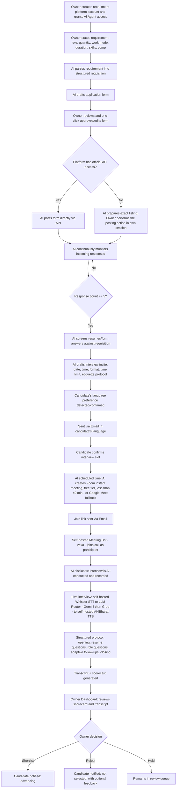

# Workflow Document
## AI Recruiter Agent — Conversational Agentic Hiring Assistant

**Version:** 3.0 (Revised for zero-cost stack: Email-only messaging, self-hosted meeting bot/speech, LLM quota-pause handling)
**Date:** July 19, 2026

---

## 1. End-to-End Process Flow

## 2. Stage-by-Stage Breakdown

### Stage 0: Account & Access Setup
- Owner creates the recruitment platform account (the product itself — a web application, signup/login via Supabase Auth) and connects available job-platform accounts (LinkedIn, Naukri, Internshala, company career page, etc.) plus Email (Brevo).
- Owner grants the AI Agent operating permission within the product — this is distinct from, and does not itself grant, official API access to third-party platforms; those remain gated per platform policy (see TRD).

### Stage 1: Requirement Intake (Conversational)
- Owner tells the AI, in plain language, what's needed: role, headcount, work mode (onsite/remote/hybrid), duration, compensation/stipend, must-have skills, eligibility.
- AI extracts structured fields and asks **one clarifying question at most** if something critical is missing or ambiguous (e.g., "Should this be open to final-year students or only graduates?").
- Structured requisition is saved as the single source of truth for the form, screening rubric, and interview question bank.

### Stage 2: Form Generation & Approval
- AI drafts a candidate-facing application form matching the requisition (resume upload, key questions, availability, language preference).
- Owner reviews in a preview screen and approves or edits — **this step is never skipped or silently auto-published**.

### Stage 3: Distribution
- Where the Owner has official platform API access, AI posts directly.
- Where it doesn't (verified: LinkedIn/Naukri/Internshala are gated or lack public APIs as of July 2026), AI prepares the exact listing text/format and the Owner performs the actual posting click within their own logged-in session — keeping a human in the loop for any action on a third-party platform's interface.

### Stage 4: Response Monitoring
- AI polls/receives applications continuously, deduplicating across sources.
- A live counter tracks responses per requisition.
- Once the response threshold is met (**default 5**, Owner-configurable), the pipeline automatically advances to outreach — no manual trigger needed.

### Stage 5: Interview Invitation (Email, Multilingual)
- AI drafts the invitation content: interview date, time, format (video call), time limit, and a short etiquette/protocol note (camera on, quiet space, ID check, punctuality expectations).
- Sent via **Email** (Brevo, free tier), in the candidate's selected language (English, Hindi, or Marathi). WhatsApp was evaluated and deliberately excluded — Meta bills business-initiated template messages with no zero-cost path around it (see [07-Financial-Subscription-Tracking.md](./07-Financial-Subscription-Tracking.md)).
- Candidate confirms their slot (or requests reschedule within an Owner-defined window).

### Stage 6: Automated Meeting Creation
- At the scheduled time, AI creates an **instant Zoom meeting** (primary path, free Basic account — capped at 40 minutes, comfortably above our 30-minute default) or a **Google Meet link** (fallback, e.g., candidate preference or Zoom unavailable).
- Join link is sent via Email shortly before start time.

### Stage 7: Live AI-Conducted Interview
- **Vexa** (open source, self-hosted meeting-bot software) joins the call as a participant — no host permission required, works the same way across Zoom and Meet, no per-minute vendor fee. Vexa, Whisper, and the TTS model all run together on one **persistent Oracle Cloud Always Free VM** for the duration of the call (TRD §3.7/§4) — a deliberately different hosting shape from the rest of the system, which runs on serverless free tiers.
- At join, the AI **clearly discloses** that it is an AI interviewer and that the session is recorded (reinforcing the earlier written notice).
- Real-time pipeline: candidate's spoken answer → **self-hosted Whisper (STT)** → **LLM Router** (Gemini free tier, Groq free tier fallback — question logic, grounded in resume + running conversation) → **self-hosted AI4Bharat Indic Parler-TTS/IndicF5 (TTS)** → spoken back into the meeting.
- Handles English, Hindi, and Marathi; code-switching accuracy is weaker than a purpose-built commercial model (an accepted trade-off for zero cost — see TRD §3.7) and should be validated with dedicated multilingual testing before real candidate use.
- Follows a standard protocol: opening/rapport → resume-specific questions → role-relevant technical/behavioral questions → adaptive follow-ups based on answers → closing and next-steps note.

### Stage 8: Scoring & Human Review
- AI generates a transcript and a multi-dimension scorecard (communication, technical depth, problem-solving, role fit) with justification text.
- Owner reviews the scorecard and transcript on the dashboard.
- **Owner must actively confirm** shortlist, reject, or hold — the AI never finalizes this status on its own.

### Stage 9: Candidate Communication of Outcome
- Once the Owner confirms, the candidate is notified via Email.
- Rejections include a warm, specific tone — avoiding generic filler — with optional brief feedback drawn from the scorecard.

## 3. Exception Handling

- **Fewer than 5 responses after a set time window:** AI notifies the Owner and suggests either lowering the threshold or extending/broadening distribution.
- **Candidate doesn't confirm interview slot:** One reminder sent via Email; slot auto-released after the Owner-defined window.
- **Meeting bot (Vexa) fails to join:** Auto-retry twice; on continued failure, auto-reschedule with an apology message and flag the incident to the Owner.
- **Email delivery failure** (e.g., invalid address, Brevo daily free-tier cap reached): retry once after a delay, flagged for Owner awareness.
- **LLM free-tier quota exhausted (Gemini and Groq both hit their daily limit):** AI-dependent actions pause system-wide; Owner receives one reminder notification with usage detail; system resumes automatically at the next quota reset — no cost is incurred and no manual restart is needed (see TRD §3.1a).
- **Language detection uncertain:** AI defaults to the language the candidate used in their application/first response, confirms once at the start of the interview ("We can continue in English or would you prefer Hindi/Marathi?").

## 4. Candidate-Facing Journey (Summary)

1. Sees listing on a platform, applies via the AI-generated form.
2. Gets an application confirmation.
3. Once the requisition hits its response threshold, receives an interview invite by Email with all logistics and etiquette notes in their preferred language.
4. Confirms slot.
5. Shortly before the scheduled time, receives the meeting join link.
6. Joins the call; AI discloses it's an AI interviewer and the session is recorded, then conducts the interview conversationally in the candidate's language.
7. Receives a status update once the Owner has reviewed and decided.
